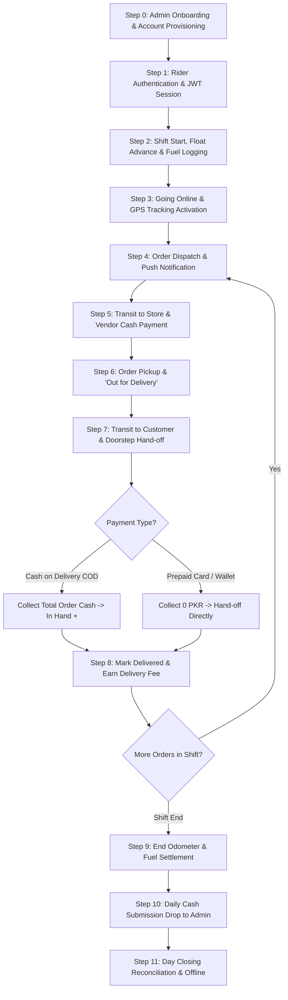

# ServeNow — Complete Rider Workflow Guide (From 0 to End)

> **Document Version:** 1.0.0  
> **Target Audience:** Developers, Operations, Dispatchers, and Product Managers  
> **System Scope:** Backend (`routes/orders.js`, `routes/riders.js`, `routes/financial.js`, `routes/wallets.js`), Mobile App (`mobile_app/lib/screens/rider_dashboard_screen.dart`), Database (`database/schema.sql`).

---

## Executive Summary & Workflow Lifecycle



---

## Phase 1: Onboarding & Account Provisioning (Step 0)

### 1.1 Admin Creation of Rider Profile
Riders do not self-register via a public sign-up form. Instead, the Operations Admin provisions rider accounts through the Admin Console or API:
- **API Endpoint:** `POST /api/riders` (Restricted to `requireAdmin`).
- **Required Fields:**
  - `fullName` (or `firstName` / `lastName`)
  - `email` (Unique identifier)
  - `phone`
  - `password` (Hashed using `bcrypt` with salt rounds = 10)
  - `vehicleType` (e.g., `Motorcycle`, `Bicycle`, `Scooter`, `Car`, `Van`)
  - `licenseNumber`
- **KYC & Document Verification:**
  - `idCardNum` (CNIC format: `XXXXX-XXXXXXX-X`)
  - `idCardUrl` / `idCardBase64` (Uploaded to `/uploads/rider_id_*`)
  - `imageUrl` / `imageBase64` (Profile picture resized via `sharp` into thumbnail variants)
- **Initial Flags:**
  - `is_active = TRUE` (Account enabled)
  - `is_available = FALSE` (Off-duty by default)

### 1.2 Automated Ledger & Wallet Initialization
- Upon creation, a dedicated rider wallet row is created in `wallets` linked by `rider_id`:
  - `balance = 0.00`
  - `user_type = 'rider'`
  - `total_credited = 0.00`
  - `total_spent = 0.00`

---

## Phase 2: Authentication & Duty Initialization

### 2.1 Rider Login & Session
- **API Endpoint:** `POST /api/auth/login`
- The authentication controller checks `users` first; if not found or invalid, it queries:
  ```sql
  SELECT * FROM riders WHERE email = ? AND is_active = true
  ```
- Passwords must be valid bcrypt hashes. Plaintext legacy passwords are automatically blocked.
- On success, the API issues:
  - **Access Token:** Short-lived JWT containing `{ id: rider.id, user_type: 'rider', email, first_name }`.
  - **Refresh Token:** Stored in `refresh_tokens` table for seamless background renewal.
  - **Audit Logging:** An entry is logged into `login_logs` with IP and timestamp.

### 2.2 Shift Float & Office Advance
Before hitting the road, the rider may receive a starting cash float from the office for change or fuel:
- **Movement Type:** `'advance'` in `rider_cash_movements`.
- **Effect on Cash Flow:** Increases the rider's **Cash in Hand** responsibility.

### 2.3 Starting Fuel & Odometer Logging
- **API Endpoint:** `POST /api/riders/:id/fuel-history`
- The rider or fleet manager records:
  - `start_meter` (Odometer reading at shift start)
  - `petrol_rate` (Current fuel rate per liter)
  - `fuel_cost` (Cash spent on petrol)
- This expense is credited against the rider's cash collections during daily closing.

### 2.4 Going Online & Background GPS Tracking
- The rider toggles their status to **Online / Available** in the app:
  - Updates `riders.is_available = TRUE`.
- The mobile app starts `RiderBackgroundTrackingService`:
  - Broadcasts GPS coordinates to `POST /api/orders/rider/location`.
  - Records continuous telemetry in `rider_location_logs`.
  - Streams coordinates via WebSockets to the Admin Radar map.

---

## Phase 3: Order Assignment & Dispatch

### 3.1 Order Dispatch Pipeline
1. A customer places an order via the mobile app or web app.
2. The store receives and accepts the order (`pending` → `confirmed` → `preparing` → `ready`).
3. The Admin/Dispatcher or Automated Dispatch Engine assigns the order to an active rider:
   - **API Endpoint:** `POST /api/orders/:id/assign-rider`
   - Sets `orders.rider_id = ?`.
   - Status updates to `ready` or `out_for_delivery`.
   - Fires a real-time WebSocket push event (`rider_notification` / assignment bell) to the rider's device.

### 3.2 Rider Dashboard Recognition
- In `RiderDashboardScreen` (Tab 1: Active Deliveries):
  - Listens to background notifications and periodic polling (`GET /api/orders/rider/deliveries`).
  - Card displays Store Name, Store Address, Customer Name, Delivery Address, Item Count, and Total Amount.
  - Highlights whether the order is **COD (Cash on Delivery)** or **Prepaid**.

---

## Phase 4: Store Pickup & Vendor Settlement

### 4.1 Navigation to Vendor
- The rider taps **Navigate to Store**, opening external GPS (Google Maps).
- Rider can tap **Call Store** or **WhatsApp Store** directly from quick-action buttons.

### 4.2 Paying the Store (If Cash Settlement Required)
- If the store operates on an instant cash-pickup model:
  - The rider pays the store amount out of their shift cash float.
  - Recorded as `store_payment` in `rider_cash_movements`.
  - This reduces the rider's physical **Cash in Hand** and is credited during day closing.

### 4.3 Pickup Confirmation
- Rider inspects items against the order checklist.
- Rider taps **Pick Up / Out for Delivery**:
  - Global status updates to `out_for_delivery`.
  - Timestamp `picked_up_at` is recorded.
  - Push notification is sent to customer: *"Your order is on the way!"*

---

## Phase 5: Transit & Customer Hand-off

### 5.1 Route Navigation & Live Telemetry
- Rider navigates to customer delivery coordinates.
- During transit, mobile app streams coordinates to `POST /api/orders/:id/rider-location`.
- The customer tracking screen shows a real-time moving bike icon with estimated delivery time (ETA).

### 5.2 Arrival at Customer Doorstep
- The rider uses in-app action buttons to call or SMS the customer upon arrival.

---

## Phase 6: Payment Collection & Delivery Completion

### 6.1 Payment Processing Scenarios

| Payment Method | Customer Payment Action | Rider Cash Action | Order Payment Status |
| :--- | :--- | :--- | :--- |
| **Cash on Delivery (COD)** | Hands physical cash to rider (`total_amount = items + delivery_fee`) | Rider accepts cash. Physical Cash in Hand **increases**. | Rider marks payment as `'paid'`. |
| **Online / Prepaid (Card / Wallet)** | Already paid at checkout | Rider collects **0.00 PKR** from customer. | Already marked `'paid'`. |

### 6.2 Delivery Completion & Earnings Credit
- Rider confirms hand-off by tapping **Mark Delivered**:
  - **API Endpoint:** `PUT /api/orders/:id/status` with `status: 'delivered'`.
  - Sets `delivered_at = NOW()`.
- **Financial Ledger Updates:**
  - `orders.delivery_fee` is credited to the rider's earnings ledger.
  - If COD: `total_amount` is registered under `cash_collection` in `rider_cash_movements`.

---

## Phase 7: Daily Cash Flow & Wallet Accounting

ServeNow separates **Physical Cash in Hand** from the **Rider Digital Wallet**:

### 7.1 Physical Cash in Hand Formula
The exact net cash the rider is physically carrying in their pocket at any moment during their shift:

$$\text{Net Cash in Hand} = (\text{Office Advance} + \text{COD Collected}) - (\text{Store Payments} + \text{Fuel Paid} + \text{Cash Drops})$$

- **Office Advance:** Starting float received from admin.
- **COD Collected:** Total cash received from customers for cash deliveries.
- **Store Payments:** Cash paid to restaurants/vendors at pickup.
- **Fuel Paid:** Cash spent on petrol during shift.
- **Cash Drops:** Partial cash handed back to office during the shift.

### 7.2 Rider Digital Wallet (`wallets` Table)
- Tracks the rider's net platform earnings, commission withholdings, and digital payouts.
- When an order is completed, delivery fee earnings are added to `total_credited`.
- When funds are settled or disbursed, the balance adjusts accordingly.

---

## Phase 8: Shift End, Cash Drop & Day Closing (Step End)

### 8.1 Final Odometer & Fuel Verification
- At shift conclusion, the rider enters the `end_meter` reading.
- Total distance traveled ($\text{Distance} = \text{End Meter} - \text{Start Meter}$) and petrol consumption are calculated and archived in `riders_fuel_history`.

### 8.2 Physical Cash Submission (Cash Drop to Admin)
1. Rider arrives at the hub/office and presents the calculated **Net Cash in Hand**.
2. Rider submits cash submission:
   - **Movement Type:** `cash_submission` in `rider_cash_movements`.
   - **Receipt Voucher:** Admin issues a Cash Receipt Voucher (CRV) or approves the submission in the Financial Manager.
   - Once approved, the cash submission offsets the collected cash, bringing physical cash liability back to **0.00 PKR**.

### 8.3 Day Closing Ledger Lock
- **API Endpoint:** `POST /api/orders/rider/close-day`
- Compiles the final shift report into `rider_day_closings`:
  - `closed_date`: Today's date (`YYYY-MM-DD`)
  - `wallet_balance`: Final digital wallet balance
  - `cash_collection`: Total COD collected
  - `office_advance`: Total float received
  - `store_payment`: Total vendor payments
  - `fuel_payment`: Total petrol expenses
  - `delivery_fee_earned`: Total rider earnings
  - `notes`: Any discrepancies, flat tires, or route issues
- The shift is formally locked, and audit records are sealed.

### 8.4 Going Offline
- Rider toggles **Offline**:
  - Sets `riders.is_available = FALSE`.
  - `RiderBackgroundTrackingService` stops GPS background broadcasting to conserve battery.
  - Rider safely logs out or closes the app until the next shift.

---

## Summary of Core Database Tables in Rider Workflow

| Table Name | Role in Rider Workflow |
| :--- | :--- |
| `riders` | Master profile, vehicle, credentials, availability status (`is_available`), active flag (`is_active`). |
| `wallets` | Digital wallet balance, cumulative credits and spends. |
| `wallet_transactions` | Audit ledger for digital credits (delivery fees, incentives) and debits. |
| `orders` | Order details, assigned rider (`rider_id`), pickup/delivery coordinates, status progression, payment method. |
| `rider_location_logs` | Historical GPS breadcrumb trail for route optimization and auditing. |
| `riders_fuel_history` | Shift odometer meter readings, distance traveled, petrol rates, and fuel costs. |
| `rider_cash_movements` | Shift cash flows: `advance`, `cash_collection`, `store_payment`, `fuel_payment`, `cash_submission`. |
| `rider_day_closings` | Formal end-of-shift reconciliation summary snapshot. |
| `financial_transactions` | Central double-entry master ledger linking vouchers and settlements. |
